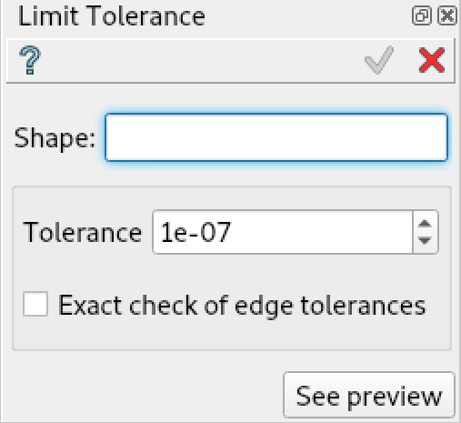

.. |limit_tol_btn.icon|    image:: images/limit_tol_btn.png

Limit Tolerance
===============

Limit Tolerance feature tries to set a new value of tolerance for the given shape. However, the final tolerance value also
depends on the initial shape topology (takes into consideration the existing gaps) to obtain a valid resulting shape.

To limit the tolerance in the active part:

#. select in the Main Menu *Features - > Limit Tolerance* item  or
#. click |limit_tol_btn.icon| **Limit Tolerance** button in the toolbar

The following property panel will be opened:

   **Limit Tolerance operation**

Here it is necessary to select a shape and give a value for the desired tolerance value.

- **Shape** sets the shape to be modified.
- **Tolerance** sets the desired tolerance value for the selected shape.
- **Exact check of edge tolerances** if checked, exact calculation of gaps
   between curves of edges and surfaces of faces will be performed.
   It takes more time, but gives better results.
   Please note, that this gap value will limit the tolerance below, but not above.

Example of usage:

#. Partition objects obj1 and obj2.
#. Partition fails.
#. Perform Limit Tolerance on objects obj1 and obj2.
#. Try to partition them again.

**TUI Command**:

.. py:function:: model.addLimitTolerance(Part_doc, shape, tolerance, isExact)

    :param part: The current part object.
    :param shape: A shape.
    :param tolerance: A tolerance value.
    :param isExact: An exact check flag.
    :return: Result shape with the modified tolerance.

Result
""""""

The Result of the operation will be the selected shape with an updated tolerance, where possible.

**See Also** a sample TUI Script of :ref:`tui_limit_tolerance` operation.
