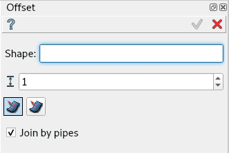
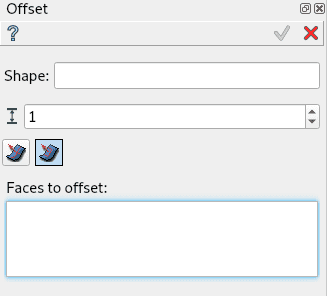
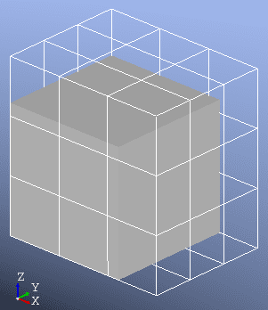

.. |offset.icon|    image:: images/offset3D.png

Offset
======

**Offset** feature translates each point of the **Shape**
along a local normal by the given **Offset distance**
(signed number, negative value means inner offset).

To create an Offset in the active part:

#. select in the Main Menu *Features - > Offset* item  or
#. click |offset.icon| **Offset** button in the toolbar

Two Offset algorithms are:

.. figure:: images/offset3D.png
   :align: left
   :height: 24px

offset the whole shape by the same value

.. figure:: images/offset3D_partial.png
   :align: left
   :height: 24px

offset selected faces by the given value, other faces by zero.

--------------------------------------------------------------------------------

Offset the whole shape by the same value
----------------------------------------

   Offset by the same value property panel

Input fields:

- **Shape** defines the base shape (solid, shell or face) selected in 3D OCC viewer or object browser;
- **Distance** defines the offset value. Negative value meaning inner offset;
- **Join by pipes** check box defines the mode of filling the gaps between translated
  adjacent surfaces:

  - if <b>Join by pipes</b> is activated, they are filled with pipes;
  - else the surfaces are extended and intersected, so that sharp edges are preserved;

**TUI Command**:

.. py:function:: model.addOffset(Part_doc, shape, dist, isPipeJoint)

    :param part: The current part object.
    :param object: A shape in format *model.selection(TYPE, shape)*.
    :param real: Offset distance value.
    :param boolean: Join by pipes/intersection flag.
    :return: Created object.

Result
""""""

Result of offset of a box. Join by pipes activated.

.. figure:: images/offset_result.png
   :align: center

   Offset of a box

**See Also** a sample TUI Script of :ref:`tui_offset` operation.

Offset selected faces by the given value, other faces by zero
-------------------------------------------------------------

   Partial Offset property panel

Input fields:

- **Shape** defines the base shape (solid, shell or face) selected in 3D OCC viewer or object browser;
- **Distance** defines the offset value. Negative value meaning inner offset;
- **Faces to offset** defines the faces of the base shape, which should be offset;

*Note*: In Partial Offset mode gaps are allways filled by intersection.

**TUI Command**:

.. py:function:: model.addOffsetPartial(Part_doc, shape, dist, faces)

    :param part: The current part object.
    :param object: A shape in format *model.selection(TYPE, shape)*.
    :param real: Offset distance value.
    :param objects: Faces of the shape in format *[model.selection(TYPE, shape), ...]*.
    :return: Created object.

Result
""""""

Result of partial offset of a box. Top and front faces selected.

   Partial offset of a box

**See Also** a sample TUI Script of :ref:`tui_offset` operation.
