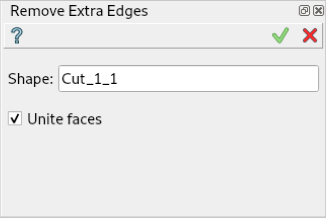
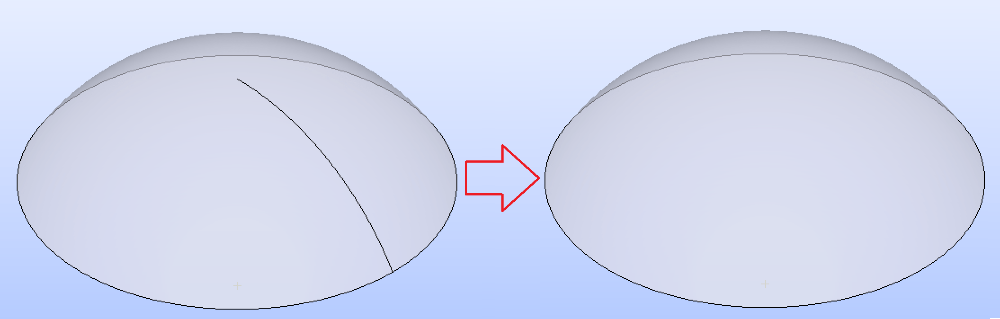

.. |remove_extra_edges.icon|    image:: images/remove_extra_edges.png

Remove Extra Edges
==================

**Remove Extra Edges** feature eliminates seam and degenerated edges from faces that lie on spherical surfaces. Also it merges adjacent same-domain edges and, optionally, adjacent same-domain faces in the same way as :ref:`fuse_faces` .

This feature is useful for processing the results of **Fuse**, **Union** or **Partition** operations.

To perform **Remove Extra Edges** in the active part:

#. select in the Main Menu *Features - > Remove Extra Edges* item  or
#. click |remove_extra_edges.icon| **Remove Extra Edges** button in the toolbar

The following property panel appears:

   **Remove Extra Edges**  property panel

Input fields:  

- **Shape** - contains object selected in the Object Browser or in the Viewer, on which extra edges will be removed.

- **Unite faces** - check it to merge adjacent same-domain faces.

**TUI Command**:

.. py:function:: model.addRemoveExtraEdges(Part_doc, shape, doUniteFaces)

    :param part: The current part object.
    :param shape: A shape in format model.selection(TYPE, shape).
    :param bool: True to merge faces. False by default.
    :return: Created object.

Result
""""""

The Result of the operation will be a shape with some eliminated edges:

   Shape before and after operation **Remove Extra Edges**

**See Also** a sample TUI Script of :ref:`tui_remove_extra_edges` operation.
