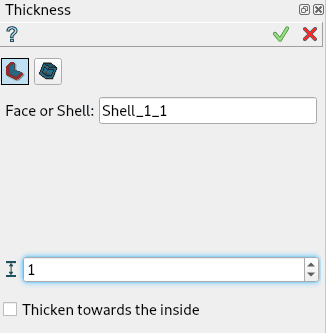
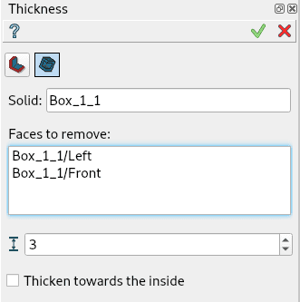

.. |thickness.icon|    image:: images/thickness.png

Thickness
=========

To create a **Thickness** or a **Hollowed Solid** in the active part:

#. select in the Main Menu *Features - > Thickness* item or
#. click |thickness.icon| **Thickness** button in the toolbar

Two Thickness algorithms are:

.. figure:: images/thickness.png    
   :align: left
   :height: 24px

make a thickness of a shell or a face

.. figure:: images/thickness2.png    
   :align: left
   :height: 24px

make a hollowed solid

--------------------------------------------------------------------------------

Thickness of a shell or a face
------------------------------

   Thickness property panel

Input fields:

- **Shape** defines the base shape (shell or face) selected in 3D OCC viewer or object browser;
- **Distance** defines the thickness value. Negative values are not allowed;
- **Thicken towards the inside** check box defines the thickening direction;

**TUI Command**:

.. py:function:: model.addThickness(Part_doc, shape, dist, isInside)

    :param part: The current part object.
    :param object: A shape in format *model.selection(TYPE, shape)*.
    :param real: Thickness value.
    :param boolean: Inside/outside direction flag.
    :return: Created object.

Result
""""""

Result of thickness of a shell.

.. figure:: images/thickness_result.png
   :align: center

   Thickness of a shell

**See Also** a sample TUI Script of :ref:`tui_thickness` operation.

Hollowed solid
--------------

   Hollowed Solid property panel

Input fields:

- **Shape** defines the base shape (solid) selected in 3D OCC viewer or object browser;
- **Distance** defines the thickness value. Negative values are not allowed;
- **Faces to remove** defines the faces of the base solid, where the hole is done;
- **Thicken towards the inside** check box defines the thickening direction;

**TUI Command**:

.. py:function:: model.addHollowedSolid(Part_doc, shape, dist, faces, isInside)

    :param part: The current part object.
    :param object: A shape in format *model.selection("SOLID", shape)*.
    :param real: Thickness value.
    :param objects: Faces of the solid in format *[model.selection("FACE", shape), ...]*.
    :param boolean: Inside/outside direction flag.
    :return: Created object.

Result
""""""

Result of hollowed solid of a box. Left and front faces selected.

.. figure:: images/thickness_result2.png
   :align: center

   Hollowed solid of a box

**See Also** a sample TUI Script of :ref:`tui_thickness` operation.
