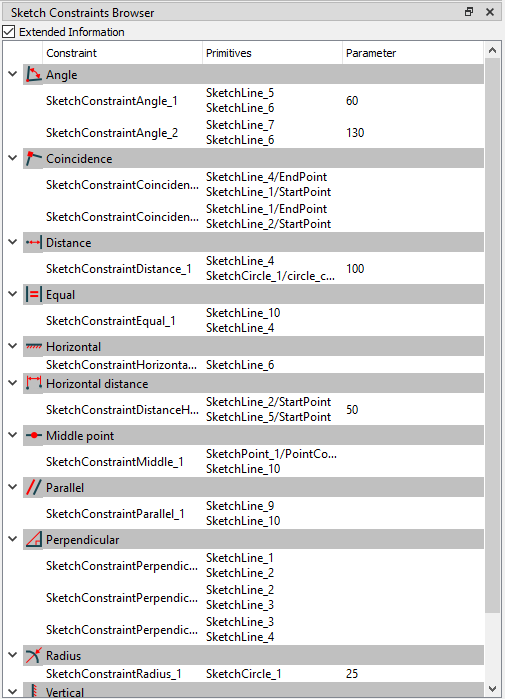
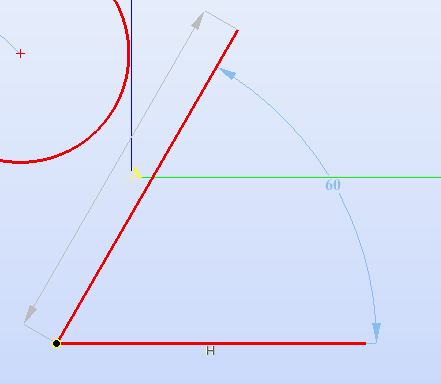
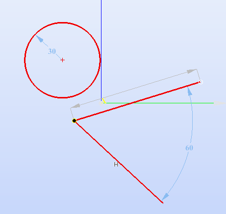

.. _sketchConstraintsBrowsers:

Sketch Constraints Browser
================

   Sketch constraints browser

- **Extended Information** check box - show/hide **Primitives** and **Parameter** columns

Right click on any constraint opens context menu:

- **Edit...** - edit value of constraint's numeric parameter, if it exists
- **Delete** - delete constraints
- **Deactivate/Activate** - (de)activate constraints

Edit
================

For constraints with a numeric parameter (Angle, Length, Radius e.t.c.), values can be changed in the following ways:

1. Select one/multiple constraint(s) -> right click -> Edit... -> hit Enter to apply;

2. Double click on a constraint value.

**Limitations:** 

1. It is not possible to set negative values to all constraints with a numeric parameter

2. It is not possible to set zero value to "Length constraint"

Delete
================

Select one/multiple constraint(s) -> rightg click -> Delete.

Deactivate
================

   Suppressed constraints
   

   Suppressed constraints moved
   
Activates/deactivates applied constraints. Deactivating the constraint allows to examine and manipulate the sketch or shape as if the constraint wasn't there.
